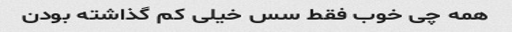
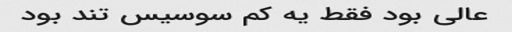
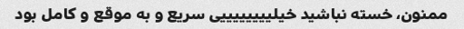

<p align="center">
  <h1 align="center">Optical Character Recognition</h1>
  <p align="center">AutoRegressive Transformer Model for Optical Character Recognition In Farasi</p>
</p>

#### **Quick Links**
- [Dependencies](#Dependencies)
- [Getting Started](#Getting-Starte)
- [Architecture](#Architecture)
- [Modules](#Modules)
- [Dataset](#Dataset)
- [Training](#Training)
- [Prediction](#Prediction)
- [License](#License)

## Dependencies
- Install Dependencies `$ pip install -r requirements.txt`
- Download Pretrained Weights [Here](https://huggingface.co/ordaktaktak/Machine-Translation)

## Getting Started
- Project Structure
```
.
├── src
│   ├── nn
│   │   ├── decoder.py
│   │   ├── encoder.py
│   │   ├── __init__.py
│   ├── dataset.py
│   ├── misc.py
│   ├── schedule.py
│   ├── tokenizer.py
│   ├── tracker.py
│   ├── trainutils.py
│   ├── trabsforms.py
│   └── vocab.py
├── build.py
├── config.py
├── inference.py
└── main.py
```

## Architecture
<p align="center">
  <div align="center"></div>
  <p align="center"> Fig. 1. Proposed Model Architecture </p>
</p>

## Modules
<p align="justify">

  <div align="justify">

  <p align="justify"><strong><a href = 'https://arxiv.org/abs/2010.11929'>ViT as Image Encoder:</a></strong> The bare ViT Model transformer outputting raw
    hidden-states without any specific head on top. This model is a PyTorch torch.nn.Module subclass. Use it as a regular PyTorch Module and refer to the
    PyTorch documentation for all matter related to general usage and behavior.</p>
  
  </div>

  <div align="justify">

  <p align="justify"><strong><a href = 'https://arxiv.org/pdf/1706.03762'>Positional Encoding:</a></strong> Since our model contains no recurrence and no 
    convolution, in order for the model to make use of the order of the sequence, we must inject some information about the relative or absolute position of the 
    tokens in the sequence. In this work, we use sine and cosine functions of different frequencies:</p>
  <p align="center"> $\ PE_{(pos, 2i)} = \sin({\frac{pos}{10000^\frac{2i}{d_{model}}}})$ </p>
  <p align="center"> $\ PE_{(pos, 2i+1)} = \cos({\frac{pos}{10000^\frac{2i}{d_{model}}}})$ </p>
  
  </div>

  <div align="justify">

  <p align="justify"><strong><a href = 'https://arxiv.org/pdf/1706.03762v7'>Multi-Head Attention:</a></strong> Multi-head Attention is a module for attention 
    mechanisms which runs through an attention mechanism several times in parallel. The independent attention outputs are then concatenated and linearly 
    transformed into the expected dimension. Intuitively, multipleattention heads allows for attending to parts of the sequence differently (e.g. longer-term 
    dependencies versus shorter-term dependencies).</p>
  <p align="center"> $\ MultiHead(Q, K, V) = Concat(head_1, ..., head_h)W^0$ </p>
  <p align="center"> where $\ head_i = Attention(Q{W_i}^Q, K{W_i}^K, V{W_i}^V)$</p>
  <p align="center"> $\ Attention(Q, K, V) = softmax(\frac{QK^T}{\sqrt{d_k}})V$</p>
  <p align="justify"> above $\ W$ are all learnable parameter matrices.</p>
  
  </div>

</p>

## Dataset
<div align="center">
  We Use <strong>Persian-OCR-230k</strong> DataSet For Train Our Model That You Can Find It <a href = 'https://huggingface.co/datasets/ordaktaktak/Persian-OCR-230k'>
    Here
  </a>
</div>

## Training
<p align="center">
  <div align="center"></div>
</p>

## Prediction
```bash
python3 inference.py path/to/image/file.png
```
<table align = "center">
  <tr>
      <td><strong>Image</strong></td>
      <td><strong>Actual Text</strong></td>
      <td><strong>Prediction</strong></td>
      <td><strong>WER</strong></td>
      <td><strong>CER</strong></td>
  </tr>
  
  <tr>
      <td></img></td>
      <td><div align="center">همه چی خوب فقط سس خیلی کم گذاشته بودن</div></td>
      <td><div align="center">همه چی خوب فقط سس خیلی کم گذاشته بودن</div></td>
      <td><div align="center">0.0</div></td>
      <td><div align="center">0.0</div></td>
  </tr>
  
  <tr>
      <td></img></td>
      <td><div align="center">عالی بود فقط یه کم سوسیس تند بود</div></td>
      <td><div align="center">عالی بود فقط یه کم سوسیس تند بود</div></td>
      <td><div align="center">0.0</div></td>
      <td><div align="center">0.0</div></td>
  </tr>

  <tr>
      <td></img></td>
      <td><div align="center">پیتزا سرد سرد بود واقعا خوشمزه نبود</div></td>
      <td><div align="center">پیتزا سرد سرد بود اصلا خوشمزه نبود</div></td>
      <td><div align="center">0.14</div></td>
      <td><div align="center">0.05</div></td>
  </tr>

  <tr>
      <td></img></td>
      <td><div align="center">ممنون، خسته نباشید خیلی سریع و به موقع و کامل بود</div></td>
      <td><div align="center">ممنون، خسته نباشید خیلی سریع و به موقع و کامل بود</div></td>
      <td><div align="center">0.0</div></td>
      <td><div align="center">0.0</div></td>
  </tr>

</table>


## 🛡️ License <a name="license"></a>
Project is distributed under [MIT License](https://github.com/Saeed-Biabani/Optical-Character-Recognition/blob/main/LICENSE)
